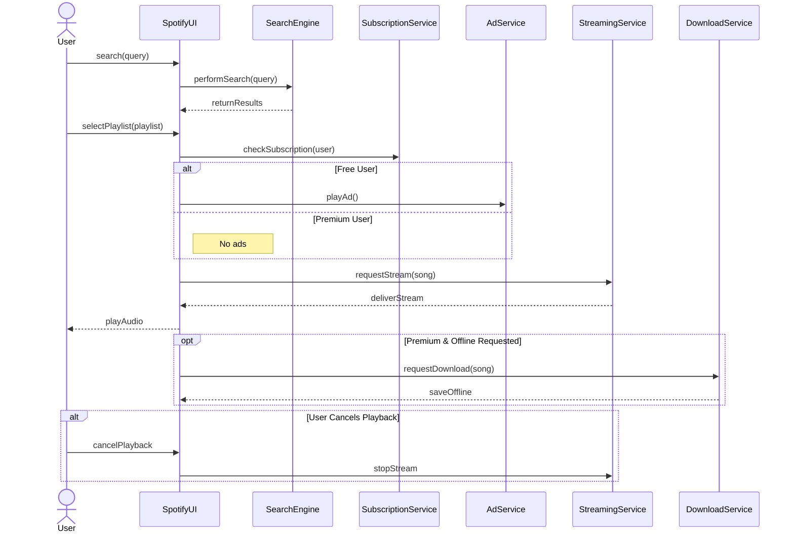

```mermaid
sequenceDiagram
    actor User
    participant SpotifyUI
    participant SearchEngine
    participant SubscriptionService
    participant AdService
    participant StreamingService
    participant DownloadService

    User ->> SpotifyUI: search(query)
    SpotifyUI ->> SearchEngine: performSearch(query)
    SearchEngine -->> SpotifyUI: returnResults

    User ->> SpotifyUI: selectPlaylist(playlist)
    SpotifyUI ->> SubscriptionService: checkSubscription(user)

    alt Free User
        SpotifyUI ->> AdService: playAd()
    else Premium User
        note right of SpotifyUI: No ads
    end

    SpotifyUI ->> StreamingService: requestStream(song)
    StreamingService -->> SpotifyUI: deliverStream
    SpotifyUI -->> User: playAudio

    opt Premium & Offline Requested
        SpotifyUI ->> DownloadService: requestDownload(song)
        DownloadService -->> SpotifyUI: saveOffline
    end

    alt User Cancels Playback
        User ->> SpotifyUI: cancelPlayback
        SpotifyUI ->> StreamingService: stopStream
    end

```
