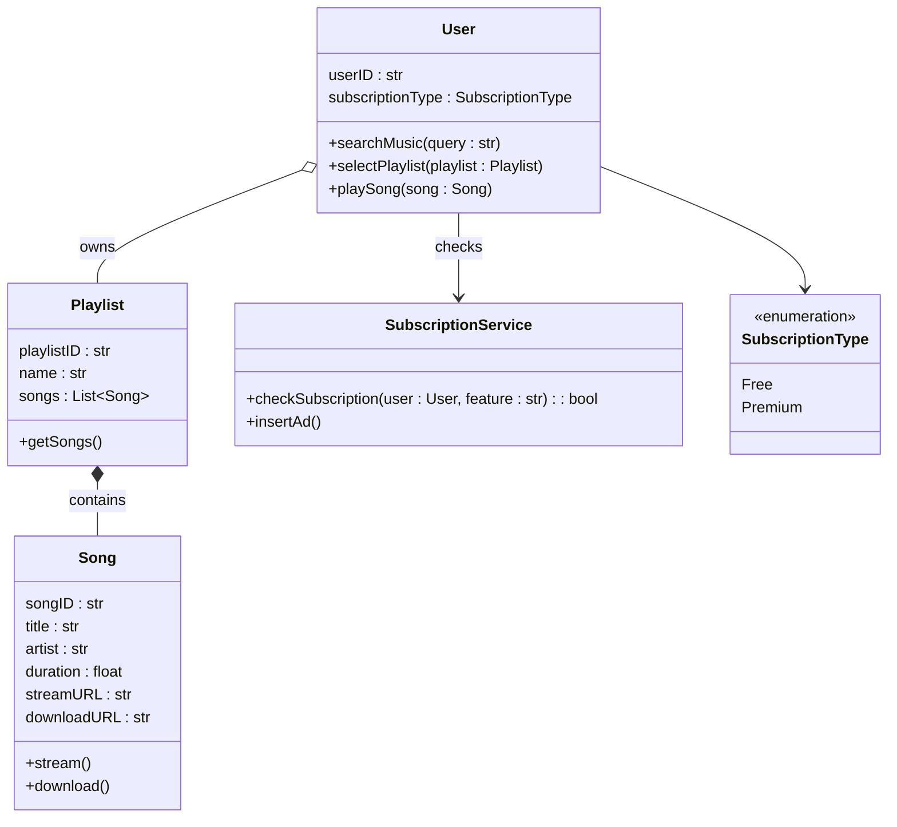

```mermaid
classDiagram
    direction TB

    %% User
    class User {
        userID : str
        subscriptionType : SubscriptionType
        +searchMusic(query : str)
        +selectPlaylist(playlist : Playlist)
        +playSong(song : Song)
    }

    %% Playlist
    class Playlist {
        playlistID : str
        name : str
        songs : List~Song~
        +getSongs()
    }

    %% Song
    class Song {
        songID : str
        title : str
        artist : str
        duration : float
        streamURL : str
        downloadURL : str
        +stream()
        +download()
    }

    %% Subscription service
    class SubscriptionService {
        +checkSubscription(user : User, feature : str) : bool
        +insertAd()
    }

    %% Enum
    class SubscriptionType {
        <<enumeration>>
        Free
        Premium
    }

    %% Relationships
    User --> SubscriptionService : checks
    User o-- Playlist : owns
    Playlist *-- Song : contains
    User --> SubscriptionType


```
